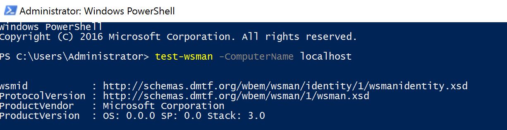

# HelloID-Conn-Prov-Target-SkypeForBusiness

## This is a work in progress

The _'HelloID-Conn-Target-SkypeForBusiness'_ connector uses a _Skype For Business On-Premise' installation. This means the connector also needs to be executed 'on-premises'. Make sure you have 'Windows PowerShell 5.1' installed on the server where the 'HelloID agent and provisioning agent' are running, and that the 'Execute on-premises' switch is toggled.

### Todo

The connector is not yet tested on a SkypeForBusiness implementation. Therefore, changes might have to made within source code.

## Table of contents

- Introduction
- Prerequisites
- Setup the connector

## Prerequisites

- [ ] Windows PowerShell 5.1 installed on the server where the 'HelloID agent and provisioning agent' are running
- [ ] PowerShell remoting / WinRM is enabled on the server where SkypeForBusiness is installed
- [ ] Make sure that _Use account data from other systems_ on the 'Account' tab is configured to use 'Microsoft Active Directory'


image-1 - ad

### Supported PowerShell versions
Currently the connector only supports 'Windows PowerShell 5.1'

### To make sure that 'remoting' is enabled

1. Open a new PowerShell console
2. Execute the code pasted below:

```powershell
Test-WSMan -ComputerName __ServerName__
```

Is remoting is enabled, you should receive an output similiar as in the image below. _(image-2 - wsman)_


image-2 - wsman
 
When you receive an error message, PSremoting is not properply configured.

### Configure PSSremoting by GroupPolicy

1. Enable the WinRM service.
Computer Configuration -> Policies -> Administrative Templates -> Windows Components -> Windows Remote Management (WinRM) -> WinRM Service -> _Allow remote server management through WinRM_

2. Make sure the WSMan service will be started automatically
Computer Configuration -> Policies -> Windows Settings -> Security Settings -> System Services -> _Windows Remote Management (WS-Management)_

3. Allow 'WinRM' in the Firewall configuration
    
    a. Create a new _Predefined_ inbound rule
    b. Select 'Windows Remote Management' from the dropdown list

## Setup the connector

1. Make sure all the prerequisites are met

2. Add a new 'Target System' to HelloID and make sure to import all the necessary files.

    - [ ] configuration.json
    - [ ] disable.ps1
    - [ ] enable.ps1

3. Fill in the required fields on the 'Configuration' tab.

## Remarks
The 'Enable.ps1' has a few options that require input from the customer.

```powershell
Set-CsUser -Identity $Using:account.userPrincipalName -EnterpriseVoiceEnabled $Using:connectionSettings.EnterpriseVoiceEnabled -ExchangeArchivingPolicy $Using:connectionSettings.ExchangeArchivingPolicy -LineURI $LineUrl -ErrorAction Stop

Grant-CsDialPlan -Identity $Using:account.userPrincipalName -PolicyName ''  -ErrorAction Stop
Grant-CsVoicePolicy -Identity $Using:account.userPrincipalName -PolicyName ''  -ErrorAction Stop

Grant-CsExternalAccessPolicy -Identity $Using:account.userPrincipalName -PolicyName '' -ErrorAction Stop
```

- Enable-CSUser -SipAddress
- Set-CSUser -LineURI
- Set-CSDialPlan -PolicyName
- Set-CSVoidePolicy -PolicyName
- Grant-CSExternalAccessPolicyName

For the above cmdlets, input is required from the customer.
